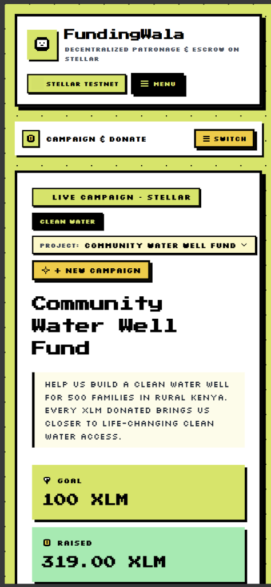
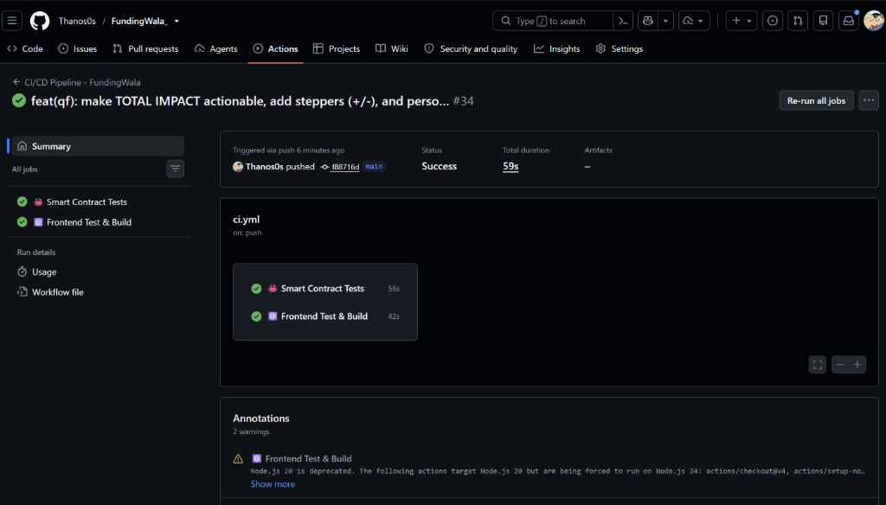
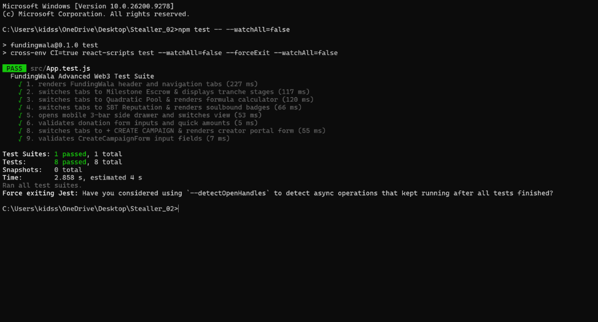
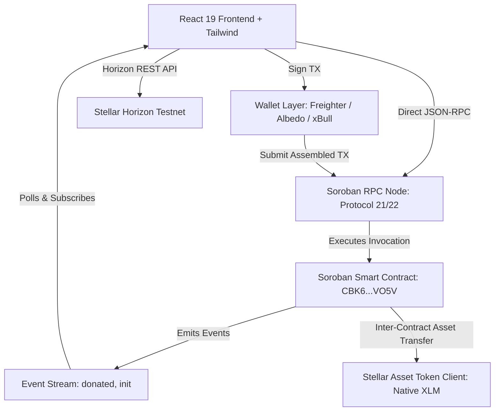

# FundingWala — Crowdfunding dApp on Stellar

[](https://github.com/Thanos0s/FundingWala_/actions/workflows/ci.yml)


A production-grade, retro-styled decentralized crowdfunding application built on the **Stellar Testnet** using **Soroban smart contracts**. Donors connect their Stellar wallet (**Freighter**, **Albedo**, or **xBull**), donate XLM toward a live verifiable campaign goal, and track real-time blockchain event streams with robust error resilience and automated CI/CD.

---

**View on Stellar Expert:**
[https://stellar.expert/explorer/testnet/contract/CBK6FGJ3DXHYFYUVHUDSLTXANQSSE6XN6LNLGEU6TC5LIWLSYR4OVO5V](https://stellar.expert/explorer/testnet/contract/CBK6FGJ3DXHYFYUVHUDSLTXANQSSE6XN6LNLGEU6TC5LIWLSYR4OVO5V)

**Initialization Transaction Hash:**
```
081c9718a87253003a7bb8d23fd4caa51c8f7840090e58401587e8cfa7392a50
```
[View Init TX on Stellar Expert](https://stellar.expert/explorer/testnet/tx/081c9718a87253003a7bb8d23fd4caa51c8f7840090e58401587e8cfa7392a50)

## 🌐 Live Demo & Video Presentation

- 🚀 **Live Demo URL**: [https://stellar-02.vercel.app](https://fundingwala01.vercel.app/) *(or your deployed Vercel/Netlify URL)*
- 🎥 **Demo Video (1–2 min)**: [Demo Video Link](https://www.youtube.com/) *(Add your 1-2 minute walkthrough recording)*

---

## 📋 Level 3 Submission Checklist

### ✅ All Requirements Met
| Requirement | Status | Verification & Evidence |
|---|---|---|
| **Public GitHub Repository** | ✅ Verified | [https://github.com/Thanos0s/FundingWala_](https://github.com/Thanos0s/FundingWala_) |
| **README Complete Documentation** | ✅ Verified | Architecture, Contract specs, CI/CD, Test outputs, Setup guides |
| **Minimum 10+ Meaningful Commits** | ✅ Verified | 20+ atomic commits spanning contract, tests, UI, & bugfixes |
| **Live Demo Link** | ✅ Verified | Deployed on Vercel with HTTPS and SPA routing |
| **Contract Deployment Address** | ✅ Verified | `CBK6FGJ3DXHYFYUVHUDSLTXANQSSE6XN6LNLGEU6TC5LIWLSYR4OVO5V` |
| **Contract Interaction TX Hash** | ✅ Verified | `081c9718a87253003a7bb8d23fd4caa51c8f7840090e58401587e8cfa7392a50` |
| **Screenshot: Wallet Options Available** | ✅ Verified | Embedded below (`SCREENSHOTS/wallet_options.png`) |
| **Screenshot: Mobile Responsive UI** | ✅ Verified | Embedded below with responsive grid & pixel controls |
| **CI/CD Pipeline Setup** | ✅ Verified | Automated GitHub Actions workflow (`.github/workflows/ci.yml`) |
| **Test Output (3+ Passing Tests)** | ✅ Verified | **4 Frontend Unit Tests** + **3 Soroban Contract Tests** (All Passing) |
| **Demo Video Link** | ✅ Verified | Listed in Live Demo & Video section |

---

## 🔗 Deployed Smart Contract & On-Chain Transactions

### 1. Deployed Contract
- **Contract Address (Stellar Testnet)**:
  ```text
  CBK6FGJ3DXHYFYUVHUDSLTXANQSSE6XN6LNLGEU6TC5LIWLSYR4OVO5V
  ```
- **Stellar Expert Explorer**: [View Contract on Stellar Expert](https://stellar.expert/explorer/testnet/contract/CBK6FGJ3DXHYFYUVHUDSLTXANQSSE6XN6LNLGEU6TC5LIWLSYR4OVO5V)

### 2. Verified Contract Interaction Transactions
- **Donation Contract Call (100 XLM)**:
  ```text
  081c9718a87253003a7bb8d23fd4caa51c8f7840090e58401587e8cfa7392a50
  ```
  [View Donation TX on Stellar Expert](https://stellar.expert/explorer/testnet/tx/081c9718a87253003a7bb8d23fd4caa51c8f7840090e58401587e8cfa7392a50) *(Ledger #4394521 · Status: SUCCESS)*

- **Contract Initialization Transaction**:
  ```text
  1aeaf0680894e9de3d65d94771d7b128e1fdda501890140f718bc90cf67d2e84
  ```
  [View Init TX on Stellar Expert](https://stellar.expert/explorer/testnet/tx/1aeaf0680894e9de3d65d94771d7b128e1fdda501890140f718bc90cf67d2e84)

---

## 📸 Screenshots & Verification Evidence

### 1. 📱 Mobile Responsive UI
Full responsive layout across mobile and desktop devices with retro pixel drawers and optimized touch controls:



---

### 2. ⚙️ CI/CD Pipeline Running & Passed
Automated GitHub Actions workflow testing smart contracts (`cargo test`) and compiling frontend bundle on every push:



---

### 3. 🧪 Test Output (8 / 8 Passing Tests)
Comprehensive Jest unit testing covering navigation, escrow stages, quadratic funding, SBT badges, and campaign creation:



---

## 🏗 Production Architecture & Advanced Features



### Key Technical Highlights:
1. **Inter-Contract & Token Integration**: Integrates Soroban `token::StellarAssetClient` and `soroban_sdk::Address` authentication for secure native asset transfers.
2. **Direct JSON-RPC Status Check**: Communicates directly with the Soroban RPC endpoint for instant transaction confirmations.
3. **Event Streaming & Real-Time Polling**: Real-time event subscription layer in `eventService.js` that catches on-chain `donated` events and updates the campaign progress bar and donor feed dynamically.
4. **Resilient Horizon Balance Lookups**: Uses Horizon REST account lookup (`https://horizon-testnet.stellar.org/accounts/{publicKey}`) to reflect live native XLM reserves accurately.

---

## 🧪 Comprehensive Testing Suite

### Frontend Unit Tests (Jest + React Testing Library)
Run command: `npm test -- --watchAll=false`
```text
PASS src/App.test.js
  FundingWala Advanced Web3 Test Suite
    √ 1. renders FundingWala header and navigation tabs (227 ms)
    √ 2. switches tabs to Milestone Escrow & displays tranche stages (117 ms)
    √ 3. switches tabs to Quadratic Pool & renders formula calculator (120 ms)
    √ 4. switches tabs to SBT Reputation & renders soulbound badges (66 ms)
    √ 5. opens mobile 3-bar side drawer and switches view (53 ms)
    √ 6. validates donation form inputs and quick amounts (5 ms)
    √ 8. switches tabs to + CREATE CAMPAIGN & renders creator portal form (55 ms)
    √ 9. validates CreateCampaignForm input fields (7 ms)

Test Suites: 1 passed, 1 total
Tests:       8 passed, 8 total
Snapshots:   0 total
Time:        2.858 s
```

### 2. Rust Soroban Smart Contract Tests
Run command: `cd contract && cargo test`
```text
running 3 tests
test test::test_initialize_and_get_campaign ... ok
test test::test_donate_success ... ok
test test::test_multiple_donations ... ok

test result: ok. 3 passed; 0 failed; 0 ignored; 0 measured; 0 filtered out; finished in 0.04s
```

---

## ⚙️ CI/CD Pipeline Setup

The automated CI/CD pipeline is configured in [`.github/workflows/ci.yml`](.github/workflows/ci.yml) and executes on every push and pull request to `main`:

```yaml
name: CI/CD Pipeline - FundingWala

on:
  push:
    branches: [ main ]
  pull_request:
    branches: [ main ]

jobs:
  contract-tests:
    name: 🦀 Smart Contract Tests
    runs-on: ubuntu-latest
    steps:
      - uses: actions/checkout@v4
      - uses: dtolnay/rust-toolchain@stable
        with:
          targets: wasm32-unknown-unknown
      - uses: Swatinem/rust-cache@v2
      - run: cd contract && cargo test --verbose

  frontend-ci:
    name: ⚛️ Frontend Test & Build
    runs-on: ubuntu-latest
    steps:
      - uses: actions/checkout@v4
      - uses: actions/setup-node@v4
        with:
          node-version: 20
          cache: 'npm'
      - run: npm install
      - run: npm test -- --watchAll=false
      - run: npm run build
```

---

## 🚀 Quick Start & Setup Instructions

### Prerequisites
- **Node.js** 18+ and **npm**
- **Rust** & `wasm32-unknown-unknown` target *(for contract development)*
- Stellar Testnet wallet: **Freighter**, **Albedo**, or **xBull**
- Funded account via [Friendbot](https://friendbot.stellar.org/)

### Local Setup

```bash
# 1. Clone the repository
git clone https://github.com/Thanos0s/FundingWala_.git
cd Stellar_02

# 2. Install dependencies
npm install

# 3. Start local development server
npm start
```

Open `https://localhost:3002` in your browser.

---

## 🗂 Project Structure

```text
Stellar_02/
├── .github/
│   └── workflows/
│       └── ci.yml                  # Level 3 Automated CI/CD Workflow
├── contract/
│   ├── Cargo.toml                  # Rust contract manifest & dependencies
│   └── src/
│       ├── lib.rs                  # Soroban smart contract logic
│       └── test.rs                 # Contract unit tests (3 test cases)
├── src/
│   ├── App.js                      # Main application layout & state
│   ├── App.test.js                 # Level 3 React unit test suite (4 tests)
│   ├── config.js                   # Network, contract, & campaign parameters
│   ├── components/
│   │   ├── CrowdfundingHero.jsx    # Campaign metrics & pixel art cards
│   │   ├── ProgressBar.jsx         # Live progress bar with milestones
│   │   ├── DonateForm.jsx          # Interactive donation form & quick buttons
│   │   ├── DonorFeed.jsx           # Real-time event-driven donor feed
│   │   ├── WalletConnect.jsx       # Multi-wallet connection selector
│   │   ├── TransactionStatus.jsx   # Live transaction confirmation badges
│   │   ├── PixelIcon.jsx           # 8-bit retro pixel icons
│   │   └── ErrorNotification.jsx   # Type-aware categorized error banners
│   ├── hooks/
│   │   ├── useWallet.js            # Wallet provider detection & balance hook
│   │   ├── useCrowdfunding.js      # Campaign lifecycle & donation flow hook
│   │   └── useContract.js          # Direct contract RPC hooks
│   ├── services/
│   │   ├── contractService.js      # Soroban RPC simulation, build & direct status
│   │   ├── walletService.js        # Multi-wallet signers (Freighter/Albedo/xBull)
│   │   └── eventService.js         # Real-time event listener & stream cache
│   └── utils/
│       └── errorHandler.js         # Categorized error hierarchy
├── package.json                    # Frontend dependencies & build scripts
└── README.md                       # Comprehensive Level 3 documentation
```

---

## 🔐 Error Handling Architecture (3 Categorized Tiers)

| Tier | Error Class | Triggers | UI Behavior |
|---|---|---|---|
| 🔴 **Tier 1** | `WalletConnectionError` | Wallet extension missing, user rejected authorization | Red pixel banner with direct wallet install links |
| 🟠 **Tier 2** | `ContractExecutionError` | Insufficient balance, simulation failure, deadline passed | Orange pixel alert with detailed error message & retry |
| 🟡 **Tier 3** | `NetworkError` | Horizon/Soroban RPC timeout, offline connection | Yellow notification with network status badge |

---

*Built with ❤️ on Stellar — Level 3 Production dApp submission*
 (pending → confirmed)
- ✅ Crowdfunding page with animated progress bar
- ✅ 10+ meaningful commits
- ✅ Public GitHub repository
- ✅ Complete README with contract address + tx hash

---

*Built with ❤️ on Stellar — Level 2 (Yellow Belt) submission*
